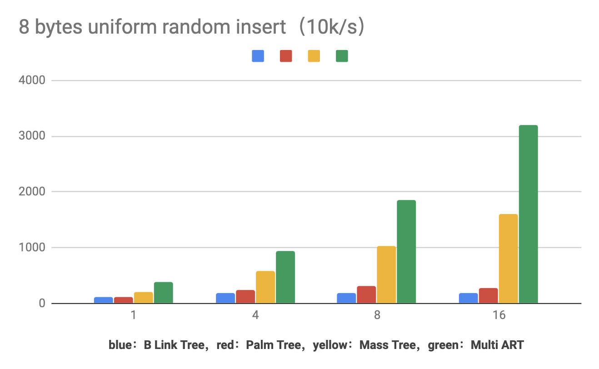

# aili
[](https://github.com/UncP)
[](https://github.com/UncP/aili)

### the fastest in-memory index in the East


A library that provides various concurrent algorithms for in-memory index, aims to achieve extremely FAST speed, but just for experiment and fun.

#### Algorithms

* Palm Tree (`palm/`)
* B<sup>link</sup> Tree (`blink/`)
* Mass Tree (`mass/`)
* Adaptive Radix Tree (`art/`)

#### Version

see `Version.md` for **brief** info  
see `ChangeLog.md` for **detail** info


#### Have a Try

```bash
#              thread_num  thread_key_number
./run.sh  palm   4           100   # test palm tree

./run.sh  blink  4           100   # test blink tree

./run.sh  mass   4           100   # test mass tree

./run.sh  art    4           100   # test art tree
```


#### Benchmark 




#### Other

+ Checkout `example/` for examples
+ Follow my [知乎专栏](https://zhuanlan.zhihu.com/b-tree) for blogs about this repository
+ Open an issue if you have any problem


#### References

- Palm Tree : [Parallel Architecture-Friendly Latch-Free Modifications to B+ Trees on Many-Core Processors](http://www.vldb.org/pvldb/vol4/p795-sewall.pdf)
- Mass Tree : [Cache Craftiness for Fast Multicore Key-Value Storage](https://pdos.csail.mit.edu/papers/masstree:eurosys12.pdf)
- B<sup>link</sup> Tree : [Efficient Locking for Concurrent Operations on B-Trees](https://www.csd.uoc.gr/~hy460/pdf/p650-lehman.pdf)
- Prefetch B+ Tree : [Improving Index Performance through Prefetching](http://www.aladdin.cs.cmu.edu/papers/pdfs/y2001/improv_ind.pdf)
- Prefix B Tree : [Prefix B-Trees](http://delivery.acm.org/10.1145/330000/320530/p11-bayer.pdf?ip=111.114.49.2&id=320530&acc=ACTIVE%20SERVICE&key=BF85BBA5741FDC6E%2E4510866D46BF76B7%2E4D4702B0C3E38B35%2E4D4702B0C3E38B35&__acm__=1537792786_42d3c27bf4ea064b8d68b89657e39bf6)
- B* Tree : The Art of Computer Programming, Volume 3, Chapter 6
- Adaptive Radix Tree : [The Adaptive Radix Tree: ARTful Indexing for Main-Memory Databases](https://db.in.tum.de/~leis/papers/ART.pdf)

